# 算法架构文档

本文档详细说明5G无线通信链路智能优化系统中各AI模块的算法架构、数据流和处理流程。

---

## 1. 系统整体架构

### 1.1 模块关系图

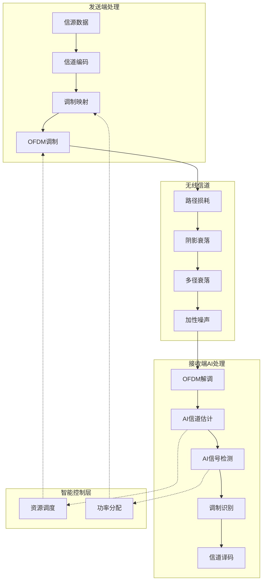

### 1.2 OFDM完整链路流程

---

## 2. AI信道估计 (AI-ChannelNet)

### 2.1 算法架构

基于Transformer架构的端到端信道估计网络，核心特性：

| 参数 | 配置 | 说明 |
|------|------|------|
| Transformer层数 | 4层 | 深度学习网络层数 |
| 注意力头数 | 8头 | 多头自注意力机制 |
| 嵌入维度 | 128 | 特征空间维度 |
| 激活函数 | GELU | 平滑激活函数 |
| Dropout率 | 0.1 | 防止过拟合 |

### 2.2 数据处理流程

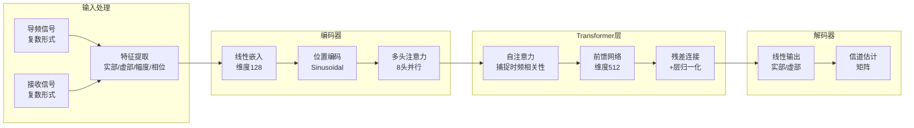

### 2.3 Transformer编码器详细架构

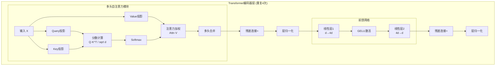

### 2.4 与传统算法对比

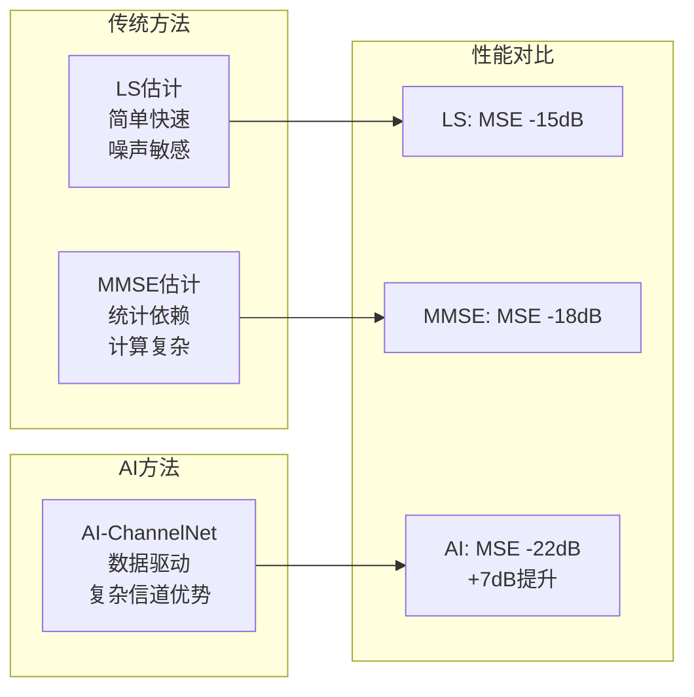

---

## 3. AI信号检测与调制识别 (SignalNet)

### 3.1 CNN-LSTM混合架构

采用三级卷积网络进行空间特征提取，双向LSTM进行时序建模：

| 参数 | 配置 | 说明 |
|------|------|------|
| CNN滤波器 | 64→128→256 | 逐层抽象特征 |
| 卷积核大小 | 3×1 | 局部特征提取 |
| LSTM层数 | 2层 | 双向时序建模 |
| LSTM单元 | 128 | 隐藏状态维度 |
| Dropout率 | 0.3 | 防止过拟合 |

### 3.2 信号检测数据流

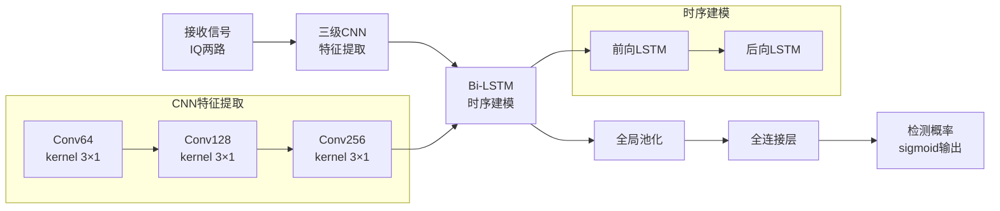

### 3.3 调制识别网络架构

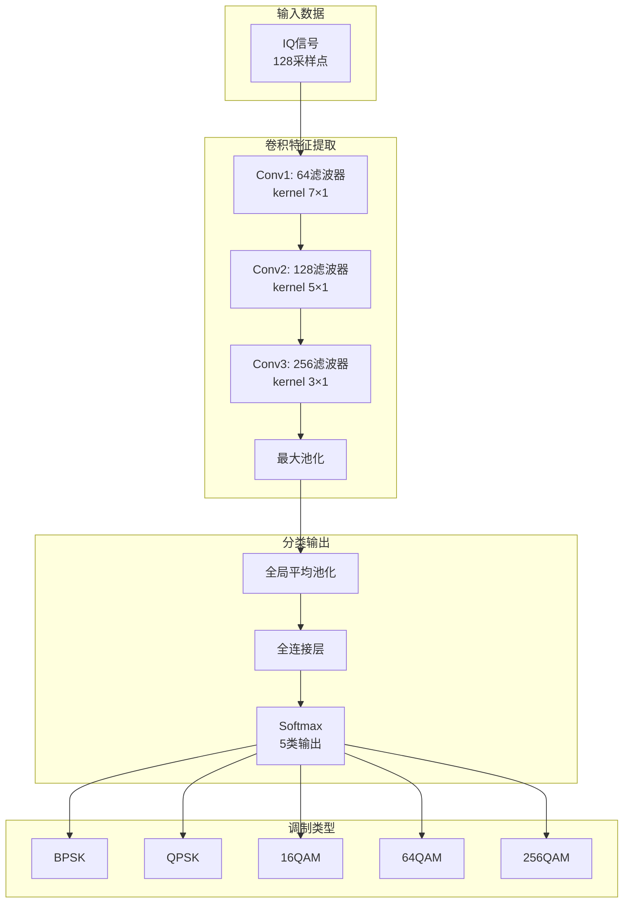

### 3.4 处理流程序列图

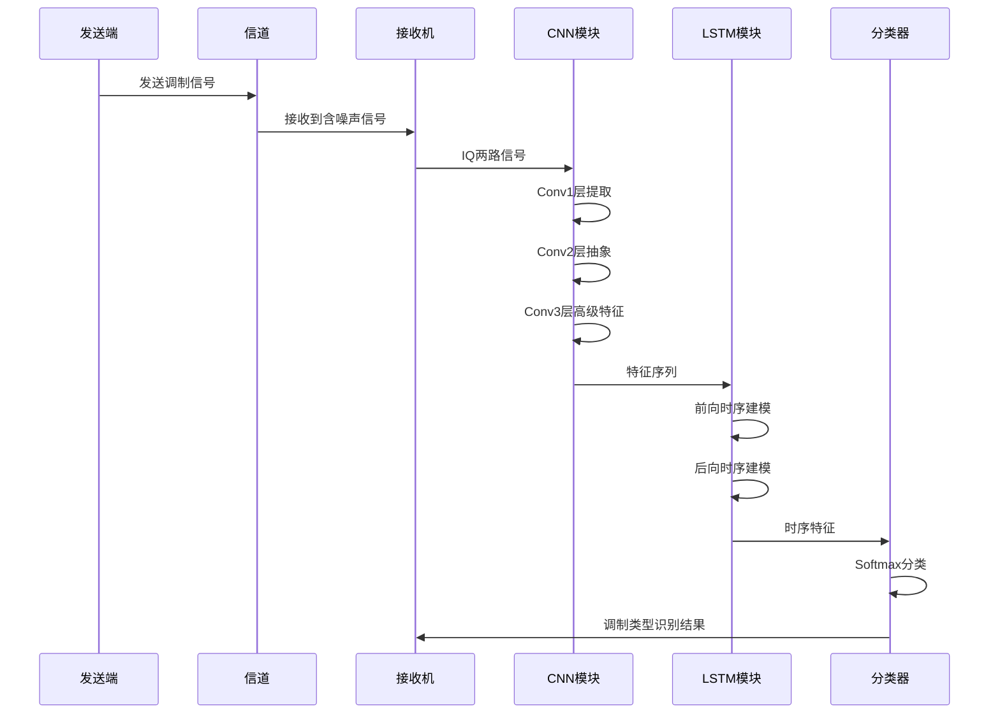

---

## 4. 智能资源调度 (RL-Scheduler)

### 4.1 强化学习框架

基于PPO (Proximal Policy Optimization) 算法的资源调度：

| 参数 | 配置 | 说明 |
|------|------|------|
| 折扣因子 γ | 0.99 | 长期收益权重 |
| GAE参数 λ | 0.95 | 优势函数估计 |
| 裁剪范围 ε | 0.2 | 策略更新限制 |
| 熵系数 | 0.01 | 探索鼓励 |
| 学习率 | 3e-4 | Adam优化器 |

### 4.2 状态-动作-奖励设计

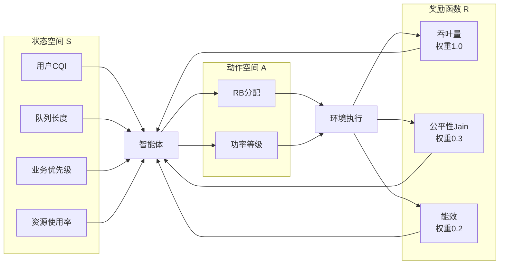

### 4.3 PPO算法流程

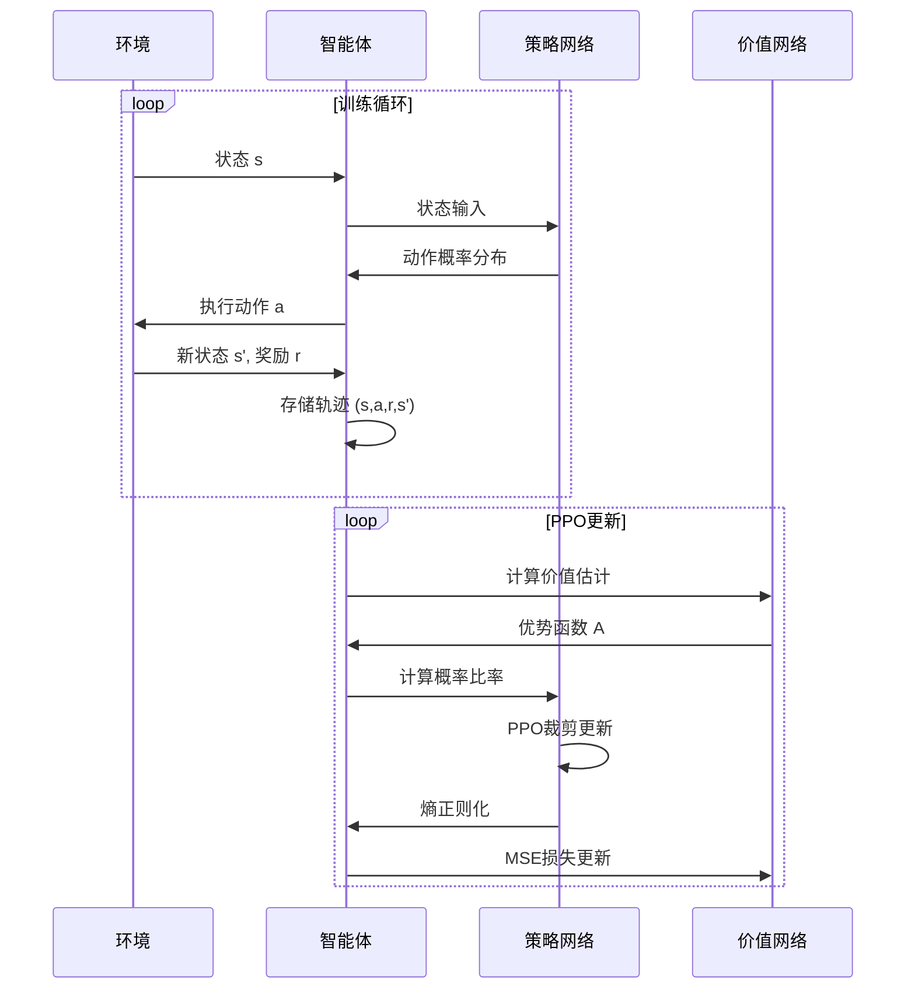

### 4.4 资源调度详细流程

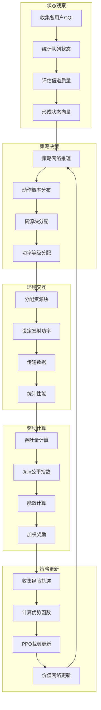

---

## 5. 性能评估体系

### 5.1 指标体系架构

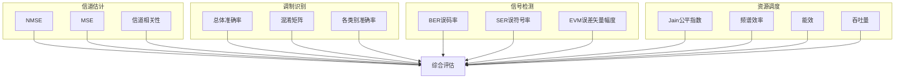

### 5.2 技术指标要求

| 模块 | 指标 | 要求 | 验证条件 |
|------|------|------|----------|
| AI信道估计 | NMSE | < -20dB | SNR ≥ 10dB |
| AI信道估计 | 性能提升 | ≥ 7dB | 相比LS估计 |
| 调制识别 | 总体准确率 | ≥ 95% | SNR ≥ 10dB |
| 调制识别 | 各类别准确率 | ≥ 90% | SNR ≥ 10dB |
| 资源调度 | 吞吐量提升 | ≥ 20% | 相比轮询调度 |
| 资源调度 | Jain公平指数 | ≥ 0.85 | 长期统计 |

---

## 6. 数据生成与增强

### 6.1 训练数据生成流程

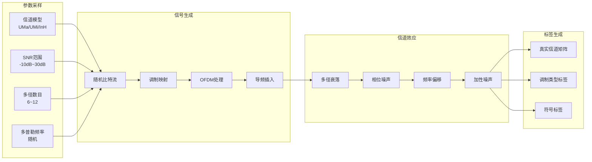

### 6.2 数据增强策略

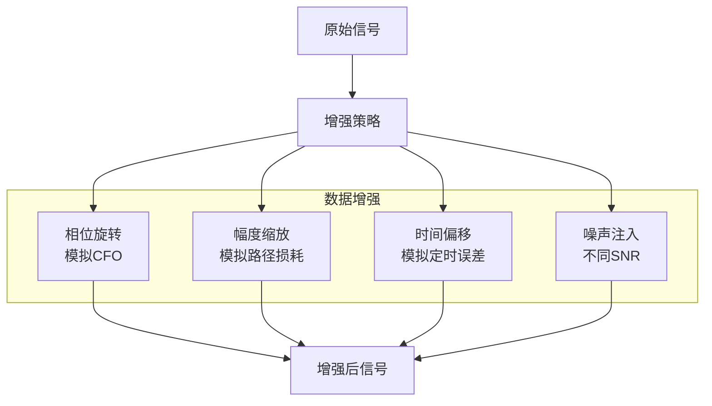

---

## 附录：5G系统参数

### 系统配置参数

| 参数 | 数值 | 符合标准 |
|------|------|----------|
| 载波频率 | 3.5 GHz | C波段5G |
| 系统带宽 | 100 MHz | 3GPP规范 |
| FFT大小 | 2048 | OFDM标准 |
| 循环前缀 | 512 | 抗多径 |
| 数据子载波 | 1200 | 有效带宽 |

---

**文档版本**: V1.0  
**更新日期**: 2026年4月