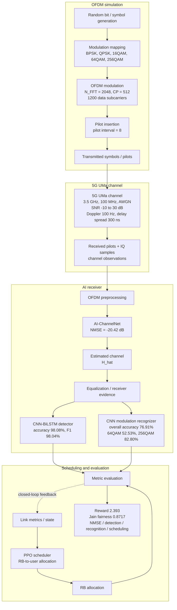

# Figure 1 — Research Workflow Information

> Recommended caption: "Fig. 1. Research workflow of the proposed AI-enabled 5G link optimization framework, from OFDM link simulation and wireless channel generation to AI-based channel estimation, signal recognition, PPO scheduling, and metric evaluation."

## Purpose

Figure 1 should show the paper-level workflow, not a full 5G NR protocol stack. The current paper and code support an OFDM software simulation with AI channel estimation, CNN-BiLSTM signal detection, CNN modulation recognition, PPO resource scheduling, and metric reporting. Do not draw channel coding, LDPC decoding, CFO/SFO correction, UMi/InH scenarios, or a hardware SDR path unless those are added to the paper and experiments.

## Layout

Use a left-to-right or top-to-bottom flow with four swim-lanes. Rounded rectangles are process blocks, lightly tinted data objects are signals/states/metrics, solid arrows are data flow, and dashed arrows are metric/control feedback. Keep the figure suitable for an IEEE two-column width.

## Mermaid Workflow Draft

Use this Mermaid diagram as the logical blueprint for the final IEEE figure. The final artwork should be redrawn as a clean vector diagram, but the module ordering and arrows should follow this structure.

## Lane 1 — OFDM Transmitter and Simulation Input

| Block | Details to show | Notes |
|---|---|---|
| Random bit / symbol generation | Random binary data and IQ samples | Supported by the simulation and signal modules. |
| Modulation mapping | BPSK, QPSK, 16QAM, 64QAM, 256QAM | These are the five reported modulation classes. |
| OFDM modulation | 2048-point FFT size, CP = 512, 1200 data subcarriers | Use "OFDM modulation" at workflow level; avoid drawing LDPC/channel coding. |
| Pilot insertion / received-pilot setup | Pilot interval = 8 | Needed for AI-ChannelNet and LS/MMSE/LMMSE comparison. |

## Lane 2 — Wireless Channel and Received Observation

| Block | Parameter |
|---|---|
| Carrier and bandwidth | 3.5 GHz carrier, 100 MHz bandwidth |
| Channel model | 5G UMa software channel |
| Fading and delay | 16 channel taps, 100 Hz Doppler, 300 ns delay spread |
| Noise | AWGN, SNR range -10 to 30 dB |
| Received observation | Received pilots and IQ samples, represented by real/imaginary features |

Avoid drawing UMi, InH, CFO, SFO, or log-normal shadowing as mandatory blocks. They are not part of the current paper's reported experiment path.

## Lane 3 — AI Receiver and Representation Learning

| Module | Architecture | Input | Output |
|---|---|---|---|
| OFDM demodulation / preprocessing | FFT-side receiver processing and real/imag feature conversion | Received pilots and IQ samples | Frequency-domain observations and IQ feature tensors |
| AI-ChannelNet | Transformer, 4 layers, 8 heads, d_model = 128, feed-forward activation, dropout = 0.1 | Pilot-aware received features `[Re(Y), Im(Y)]` | Estimated channel `H_hat` |
| Equalization / receiver evidence | Uses estimated channel and IQ observations | `H_hat` and received symbols | Equalized or feature-ready IQ sequence |
| CNN-BiLSTM detector | Conv1D 64 -> 128 -> 256, BiLSTM hidden 128, 2 layers | IQ sequence, 128 samples | Binary detection probability |
| CNN modulation recognizer | Conv1D kernels 7/5/3, filters 64/128/256, FC 512 -> 256 -> 5 in current best run | IQ sequence, 128 samples | Class: BPSK, QPSK, 16QAM, 64QAM, 256QAM |

Do not include LDPC channel decoding or "recovered bit stream" as a main block. The paper reports detection and recognition metrics, not an end-to-end coded BER chain.

## Lane 4 — Intelligent Scheduling and Evaluation

| Component | Details |
|---|---|
| Link-state / metric interface | Channel quality, queue state, recognition/detection evidence, and scheduling context |
| PPO scheduler | PPO with gamma = 0.99, lambda = 0.95, clip epsilon = 0.2, entropy coefficient = 0.01, learning rate = 3e-4 |
| Scheduling environment | 20 users, 100 resource blocks, 33 dBm max power, 10 time slots per episode |
| Action | RB-to-user allocation; the current environment uses fixed/equalized power treatment rather than explicit per-user power-control actions |
| Reward | Throughput + 0.3 x Jain fairness + 0.2 x energy efficiency |
| Metric collection | NMSE, MSE, correlation; detection accuracy/precision/recall/F1; modulation overall and per-class accuracy; PPO reward, Jain fairness, throughput |
| Feedback arrow | Dashed arrow from metrics/scheduler back to simulation configuration and resource allocation decisions |

The dashed feedback should be labeled "metric feedback / scheduling feedback". Do not imply that the entire channel estimator, detector, recognizer, and scheduler are trained end-to-end as a single differentiable loop.

## Arrows and Connections

| Arrow | Style | Label |
|---|---|---|
| Transmitter -> Channel | Solid | Tx signal |
| Channel -> AI receiver | Solid | Rx signal + pilots |
| AI-ChannelNet -> Equalization / receiver evidence | Solid or dashed | Estimated CSI |
| Detector / recognizer -> Metrics | Solid | Detection and recognition results |
| Receiver / metrics -> PPO scheduler | Dotted | Link metrics / state |
| PPO scheduler -> Scheduling environment | Solid | RB allocation |
| Metrics / PPO -> Simulation configuration | Dashed | Closed-loop feedback |

## Figure Text That Should Appear

Use short labels that can fit inside boxes:

- OFDM simulation
- 5G UMa channel
- Received pilots + IQ samples
- AI-ChannelNet
- CNN-BiLSTM detector
- CNN modulation recognizer
- PPO scheduler
- Metric evaluation
- Closed-loop feedback

## Do Not Draw

| Do not include | Reason |
|---|---|
| LDPC encoder / decoder | Not implemented or reported in the paper's experiment path. |
| UMi / InH channel branches | Current paper reports 5G UMa only. |
| CFO / SFO compensation | Not part of the reported model or metrics. |
| Explicit power-control action head | Current scheduler action is RB allocation; power is treated through environment parameters. |
| End-to-end joint neural training arrow | The current evidence supports a modular closed-loop pipeline, not one jointly trained neural network. |

## Paper and Data Consistency

| Item | Value |
|---|---|
| Carrier frequency | 3.5 GHz |
| Bandwidth | 100 MHz |
| FFT size | 2048 |
| CP length | 512 |
| Data subcarriers | 1200 |
| Channel model | 5G UMa |
| Doppler | 100 Hz |
| Delay spread | 300 ns |
| SNR range | -10 to 30 dB |
| Channel estimator result | AI-ChannelNet overall NMSE = -20.42 dB |
| Detection result | Accuracy = 98.08%, F1 = 98.04% |
| Modulation recognition result | Overall accuracy = 76.91%; 64QAM = 52.53%, 256QAM = 82.80% |
| PPO result | Last-20 average reward = 2.393, final Jain fairness = 0.8717 |

## Visual Style

- Font: Times New Roman or IEEE-compatible serif.
- Main labels: 8-10 pt; small parameter labels: 6-7 pt.
- Stroke: 1 pt boxes, 0.75 pt arrows.
- Fill: white or very light tint with colored border.
- Width: at most 7.16 in for IEEE two-column figure.
- Preferred output: vector PDF plus 300 DPI PNG preview.
- Use IEEE caption style: `Fig. 1. ...`
