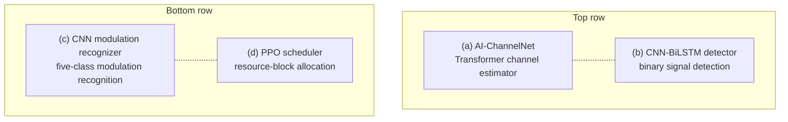
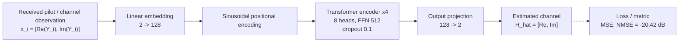
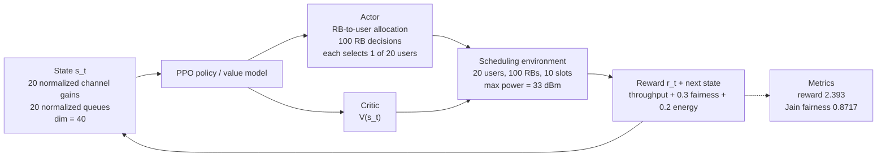

# Figure 2 — Method Architecture Information

> Recommended caption: "Fig. 2. Method architecture of the proposed framework: (a) Transformer-based AI-ChannelNet for channel estimation; (b) CNN-BiLSTM detector for binary signal detection; (c) CNN modulation recognizer for five-class modulation recognition; (d) PPO scheduler for resource-block allocation."

## Purpose

Figure 2 should be a method architecture figure. It should expose the internal structure of the four core modules without adding claims that are not supported by the paper or code. Use it to complement Fig. 1: Fig. 1 is the workflow, while Fig. 2 is the model architecture.

## Layout

Use a 2 x 2 grid of subfigures:

| Panel | Module | Role |
|---|---|---|
| (a) | AI-ChannelNet | Transformer channel estimation |
| (b) | CNN-BiLSTM detector | Binary signal detection |
| (c) | CNN modulation recognizer | Five-class modulation recognition |
| (d) | PPO scheduler | Resource-block scheduling |

All panels should flow left to right from input to output. Use dashed panel borders and short subcaptions `(a)` to `(d)`.

## Mermaid Architecture Draft

Use the following Mermaid diagrams as logical blueprints. The final IEEE figure should still be redrawn as a clean vector graphic, but the module relationships and ordering should follow these diagrams.

### Overall Panel Layout



## Panel (a) — AI-ChannelNet

Draw the current Transformer channel estimator. The input is a sequence of received complex samples represented by real and imaginary features. The output is the estimated complex channel represented as two real-valued channels.



```text
Received pilot / channel observation
    y_i = [Re(Y_i), Im(Y_i)] in R^2
        |
        v
Linear embedding: 2 -> 128
        |
        v
Sinusoidal positional encoding
        |
        v
Transformer encoder x 4
    Multi-head self-attention: 8 heads
    FFN hidden dimension: 512
    Dropout: 0.1
        |
        v
Linear output projection: 128 -> 2
        |
        v
Estimated channel H_hat = [Re(H_hat), Im(H_hat)]
```

Key labels to include:

| Item | Value |
|---|---|
| Input dimension | 2 |
| Embedding dimension | 128 |
| Attention heads | 8 |
| Transformer layers | 4 |
| FFN hidden dimension | 512 |
| Activation | Transformer feed-forward activation from the current PyTorch encoder configuration; do not label a specific non-default activation unless the implementation is changed and experiments are rerun |
| Dropout | 0.1 |
| Output dimension | 2 |
| Loss | MSE / channel loss |
| Batch size | 64 |
| Learning rate | 1e-4 |
| Reported result | Overall NMSE = -20.42 dB |

Do not label the input as only `y in C^(K x T)` unless the figure also explains the flattened sequence representation. The code uses `(batch, seq_len, 2)`.

## Panel (b) — CNN-BiLSTM Detector

Draw the detector as a local-feature extractor followed by temporal modeling. The paper calls this SignalNet / CNN-BiLSTM detector.

```mermaid
flowchart LR
  B0["IQ sequence<br/>R^(T x 2), 128 samples"]
  B1["Transpose<br/>channels-first"]
  B2["Conv1D block<br/>2 -> 64, k=3<br/>BN + ReLU"]
  B3["Conv1D block<br/>64 -> 128, k=3<br/>BN + ReLU"]
  B4["Conv1D block<br/>128 -> 256, k=3<br/>BN + ReLU"]
  B5["AdaptiveAvgPool1d<br/>length 64"]
  B6["BiLSTM<br/>2 layers, hidden 128 / direction"]
  B7["FC head<br/>256 -> 128 -> 1<br/>dropout 0.3, sigmoid"]
  B8["Detection probability"]
  B9["Metric<br/>accuracy 98.08%, F1 98.04%"]

  B0 --> B1 --> B2 --> B3 --> B4 --> B5 --> B6 --> B7 --> B8
  B8 -.-> B9
```



```text
IQ sequence: R^(T x 2), 128 samples
        |
        v
Transpose to channels-first
        |
        v
Conv1D 2 -> 64, kernel 3, padding 1
BatchNorm + ReLU
        |
        v
Conv1D 64 -> 128, kernel 3, padding 1
BatchNorm + ReLU
        |
        v
Conv1D 128 -> 256, kernel 3, padding 1
BatchNorm + ReLU
        |
        v
AdaptiveAvgPool1d output length 64
        |
        v
BiLSTM, 2 layers, hidden 128 per direction
        |
        v
Last timestep feature, dimension 256
        |
        v
Dropout 0.3 -> Linear 256 -> 128 -> ReLU
Dropout 0.3 -> Linear 128 -> 1 -> Sigmoid
        |
        v
Detection probability
```

Key labels to include:

| Item | Value |
|---|---|
| CNN filters | 64, 128, 256 |
| Kernel size | 3 |
| Adaptive pool output | 64 |
| BiLSTM layers | 2 |
| BiLSTM hidden units | 128 per direction |
| FC hidden | 128 |
| Output | 1 sigmoid probability |
| Loss | Binary cross entropy |
| Batch size | 128 |
| Learning rate | 1e-3 |
| Reported result | Accuracy = 98.08%, F1 = 98.04% |

## Panel (c) — CNN Modulation Recognizer

Draw the five-class modulation recognizer. The architecture in the current best experiment uses the single-head CNN recognizer with enlarged dense capacity. The paper result should be framed as a working five-class branch with uneven high-order QAM performance.

```mermaid
flowchart LR
  C0["IQ sequence<br/>R^(T x 2), 128 samples"]
  C1["Transpose<br/>channels-first"]
  C2["Conv1D block<br/>2 -> 64, k=7<br/>BN + ReLU + MaxPool"]
  C3["Conv1D block<br/>64 -> 128, k=5<br/>BN + ReLU + MaxPool"]
  C4["Conv1D block<br/>128 -> 256, k=3<br/>BN + ReLU + MaxPool"]
  C5["AdaptiveAvgPool1d<br/>length 32"]
  C6["Flatten<br/>256 x 32"]
  C7["Dense path<br/>8192 -> 512 -> 256 -> 5<br/>dropout 0.4"]
  C8["Softmax<br/>5 classes"]
  C9["Output<br/>BPSK, QPSK, 16QAM, 64QAM, 256QAM"]
  C10["Metric<br/>overall 76.91%<br/>64QAM 52.53%, 256QAM 82.80%"]

  C0 --> C1 --> C2 --> C3 --> C4 --> C5 --> C6 --> C7 --> C8 --> C9
  C9 -.-> C10
```



```text
IQ sequence: R^(T x 2), 128 samples
        |
        v
Transpose to channels-first
        |
        v
Conv1D 2 -> 64, kernel 7, padding 3
BatchNorm + ReLU + MaxPool1d(2)
        |
        v
Conv1D 64 -> 128, kernel 5, padding 2
BatchNorm + ReLU + MaxPool1d(2)
        |
        v
Conv1D 128 -> 256, kernel 3, padding 1
BatchNorm + ReLU + MaxPool1d(2)
        |
        v
AdaptiveAvgPool1d output length 32
        |
        v
Flatten: 256 x 32
        |
        v
Dropout 0.4 -> Linear 8192 -> dense_units -> ReLU
Dropout 0.4 -> Linear dense_units -> dense_units/2 -> ReLU
Dropout 0.4 -> Linear dense_units/2 -> 5
        |
        v
Softmax over BPSK, QPSK, 16QAM, 64QAM, 256QAM
```

Key labels to include:

| Item | Value |
|---|---|
| Kernels | 7, 5, 3 |
| Filters | 64, 128, 256 |
| Adaptive pool output | 32 |
| Dense units in current best run | 512 -> 256 -> 5 |
| Default code path | `dense_units` configurable; default is 256 |
| Output classes | 5 |
| Loss | Cross entropy |
| Batch size | 128 |
| Learning rate | 1e-3 |
| Data balancing | 256QAM x2 and 64QAM x1.5 oversampling in the current best experiment |
| Reported result | Overall accuracy = 76.91%; 16QAM = 67.53%, 64QAM = 52.53%, 256QAM = 82.80% |

Important correction: do not write "Conv1 kernel 7 (65 filters)". It should be 64 filters.

## Panel (d) — PPO Scheduler

Draw the scheduler as an actor-critic PPO policy interacting with a scheduling environment. The figure should be conceptual but aligned with the code and paper.



```text
State s_t
    normalized channel quality for 20 users
    normalized queue length for 20 users
        |
        v
PPO MLP policy / value model
        |
        +--> Actor: action distribution
        |       action = RB-to-user allocation
        |       100 RB decisions, each chooses one of 20 users
        |
        +--> Critic: V(s_t)
        |
        v
Scheduling environment
    20 users, 100 RBs, 10 time slots
    max power parameter = 33 dBm
        |
        v
Reward and next state
    r_t = throughput + 0.3 x Jain fairness + 0.2 x energy efficiency
```

Key labels to include:

| Item | Value |
|---|---|
| State dimension in current basic environment | 40 = 20 normalized channel gains + 20 normalized queues |
| Paper-level state context | Channel quality, queue state, priority/resource context |
| Action | Resource-block allocation to users |
| Action space in environment | MultiDiscrete with 100 RB decisions, each selecting one of 20 users |
| Power handling | Max-power parameter is 33 dBm; no separate explicit power-control action in the current basic environment |
| PPO gamma | 0.99 |
| GAE lambda | 0.95 |
| PPO clip epsilon | 0.2 |
| Entropy coefficient | 0.01 |
| Learning rate | 3e-4 |
| Batch size | 256 |
| Reward weights | Throughput 1.0, fairness 0.3, energy 0.2 |
| Reported result | Last-20 average reward = 2.393, final Jain fairness = 0.8717 |

Do not draw `Linear(128 -> 100)` as the policy head. The environment action is a 100-element RB allocation vector with 20 user choices per RB; Stable-Baselines3 handles this MultiDiscrete policy internally, and the fallback PyTorch path is not the publication-grade result path.

## Equation Labels To Use In The Figure

Use only short equation snippets; do not overload the diagram.

| Concept | Snippet |
|---|---|
| Complex-to-real input | `x_i = [Re(Y_i), Im(Y_i)]` |
| Attention | `softmax(QK^T / sqrt(d_k))V` |
| Channel loss | `L_H = (1/KT) sum |H_hat - H|^2` |
| Softmax recognition | `p(c|x) = softmax(o_c)` |
| Jain fairness | `J = (sum R_u)^2 / (N sum R_u^2)` |
| PPO objective | `min(rho A, clip(rho, 1-epsilon, 1+epsilon)A)` |

## Visual Conventions

- Use English text in the figure.
- Use Times New Roman or IEEE-compatible serif font.
- Main labels: 8-9 pt; parameter labels: 6-7 pt.
- Use short labels and avoid full sentences inside boxes.
- Use consistent colors:
  - Channel estimation: deep blue.
  - Signal detection / recognition: mid blue.
  - Scheduling / feedback: olive green.
  - Environment / channel: neutral gray or red-brown.
- Use vector PDF if possible; also export a 300 DPI PNG preview.

## Consistency Checklist

Before drawing, check that the final figure does not contain:

- LDPC encoder/decoder.
- UMi/InH channel branches.
- CFO/SFO blocks.
- Explicit power-control action head.
- End-to-end joint neural training claim.
- 95% modulation-recognition claim.
- Wrong modulation-recognizer filter count such as "65 filters".
- Wrong PPO policy output such as a single `Linear(128 -> 100)` action head.
- A specific non-default activation unless the implementation is changed and the reported experiment is rerun with it.
